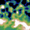
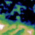
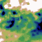
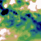
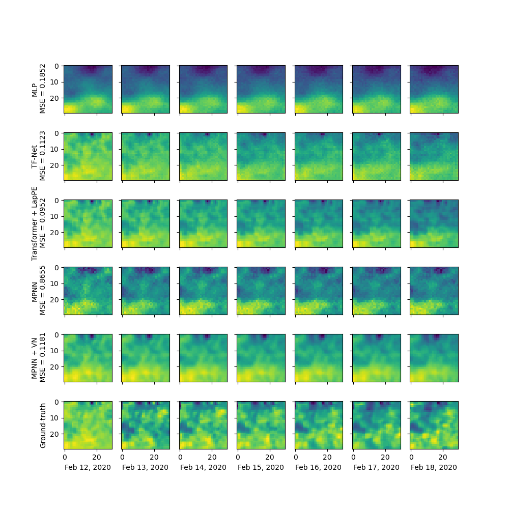

# Graph learning for climate data


Check the following directories for experiments:
* ```sst_1_region_1_day_pred/``` for experiments of predicting 1 day ahead in the future for one region of the Pacific ocean.
* ```sst_1_region/``` for experiments of predicting n days (n = 1, 7, 28, 42) ahead in the future given m days of history for one region.
* ```sst_11_regions/``` for experiments of predicting n days ahead given m days of histroy with all 11 regions (11 times more data) of the Pacific. This is the largest setting.

For each of these above directories:
* ```pyg/```: Experiments with PyTorch geometric (PyG) GNNs.
* ```pytorch/```: Experiments with (pure) PyTorch models including MLP, U-Net (CNN), Convolutional LSTM, TF-Net, Linear Transformers, MPNN and variants, etc.
* The training scripts are ```*.sh``` with the name of the model. Inside each script, one can change the hyper-parameters.
* The training programs are ```*.py``` with the name of the model. Each program trains and evaluates the corresponding model while keeping track of progress in a designated log file (see the script) and storing the best trained model/weights.

All the models are stored in ```models/```:
* ```pyg/```: PyTorch geometric (Pyg) implementation of graph neural networks, graph convolution, positional encodings.
* ```pytorch/```: PyTorch implementation of other baselines.

## Sea Surface Temperature (DOISST version 2.1)

<p align="center">
  
  
  <br>
  Historical window of 1 day: ground-truth (left) and prediction (right) by GCN with adding shortcuts
</p>

<p align="center">
  
  
  <br>
  Historical window of 7 days: ground-truth (left) and prediction (right) by GCN with adding shortcuts
</p>

<p align="center">
  
  
  <br>
  Historical window of 28 days: ground-truth (left) and prediction (right) by GCN with adding shortcuts
</p>

<p align="center">
  
  <br>
  Comparison between different models on the testing set in the setting of 6 weeks history to predict 7 days ahead. 
</p>
